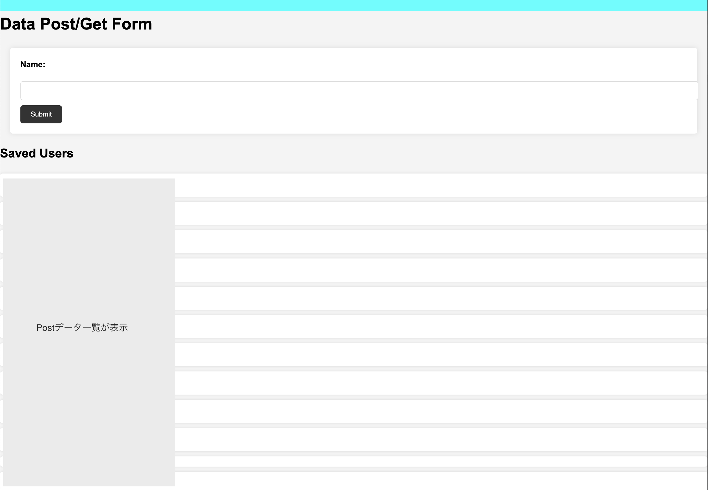

# Flask_Docker_Nginx_Postgress

Docker を使用して、Flask, Nginx, Postgres で構成されたシステム、簡単なデータのPost/Getをローカル環境にてブラウザで確認する為のプロジェクト。

 ## インストール方法

 <code>git clone https://github.com/makimac0203/flask_docker_nginx_postgress.git</code>

※ macで構築　 
※ Docker Desktop を立ち上げておく

ターミナルで実行 
・起動 
<code>make docker-run</code>

・停止削除 
<code>make docker-stop</code>

## 入力フォーム

